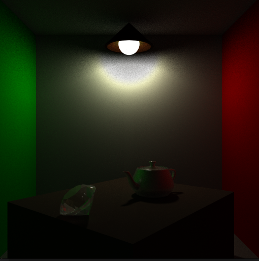
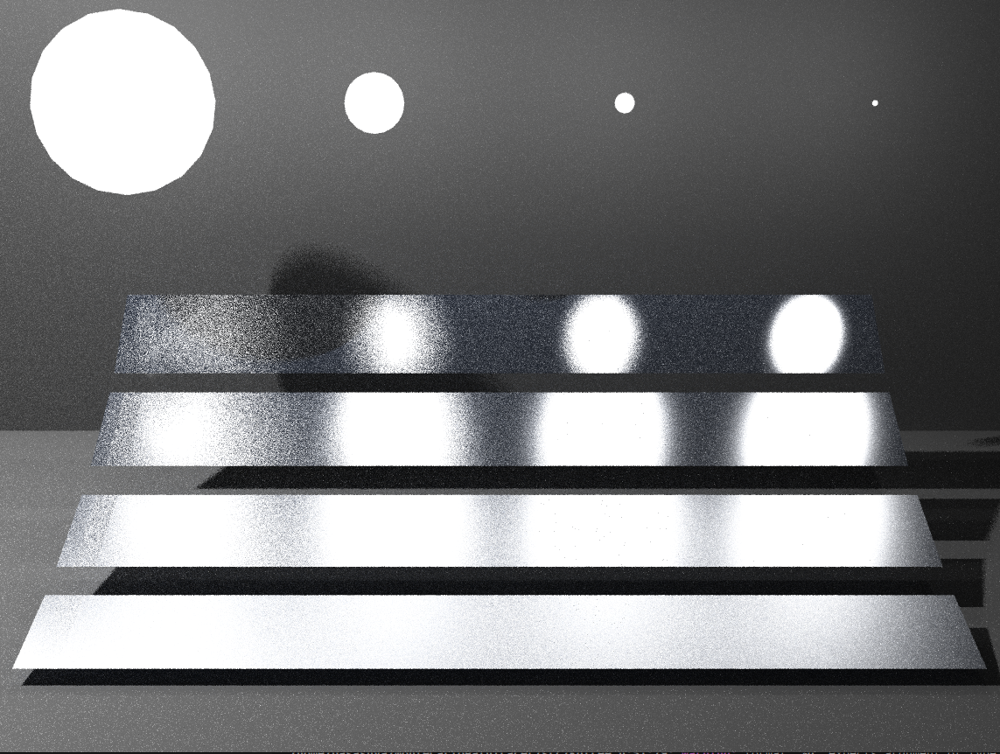

# Monte Carlo Ray Tracer

#### 1. 环境

ubuntu18.04  g++5.5 

CPU: Intel Xeon(R) CPU E3-1245 

Mermory: 32 GB

#### 2. 编译

```bash
cd MonteCarloPathTracer
bash buildAll.sh
```

#### 3. 运行

```bash
./test
./test -read 1 
# 读取第一个场景，一共有4个
./test -read 2
./test -read 3
./test -read 4
```

我们默认将obj, mtl以及光源的参数放在同级目录下,具体可见model文件夹

```bash
    model = new Model("./models/Scene03");
    scene = new Scene("./models/Scene03");
```

parameter.txt的编写规范如下

```bash
width height
position.x position.y position.z
lookat.x lookat.y lookat.z
up.x up.y up,z
fovy
number of Lights
(then each is the light parmeter:) 
radius center.x center.y center.z emission.r emission.g emission.b
```

#### 4. 原理


path tracer 从视线出发，翻过来计算每个像素的颜色。当一个ray射到物体的时候，此时的光线可以表示为:

**LightColor = DirectLight + IndirectLight + EnvironmentLight + itelfLight** 

**itselfLight = material.ke**

**EnvironmentLight =  material.ka * environmentParameter**

DirectLight 从各种光源计算所得

IndirectLight首先判断材质是玻璃，镜面还是散射(有时候需要随机)，然后每种材质分别进行计算

IndirectLight将产生一个射线，然后继续跟踪。这是一个递归的过程

当计算射线与哪个物体相交的时候，需要大量的计算(暴力枚举)，kdtree可以加速查询

**本文使用了kdtree(结合了AABB的改动)以及fopenmp(CPU多线程)做加速**

场景2一帧(每个像素的4次计算，一共512 * 512 * 4 计算)的速度大约是16s


#### 5. 效果




